# Flujos de Mensajes — Smpp Gateway

Diagramas de flujo del sistema SMPP Gateway. Todos los diagramas usan Mermaid
(renders automático en GitHub/GitLab/VS Code con extensión Mermaid).

---

## 1. Envío de SMS vía HTTP (flujo completo)

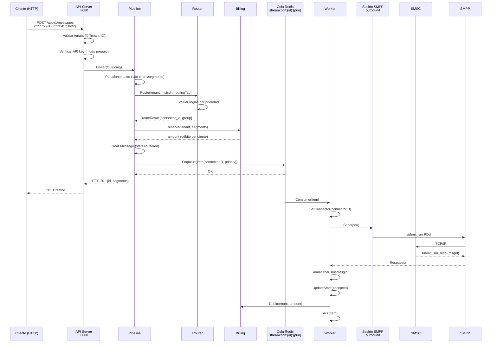

---

## 2. Recepción de DLR (Delivery Report)

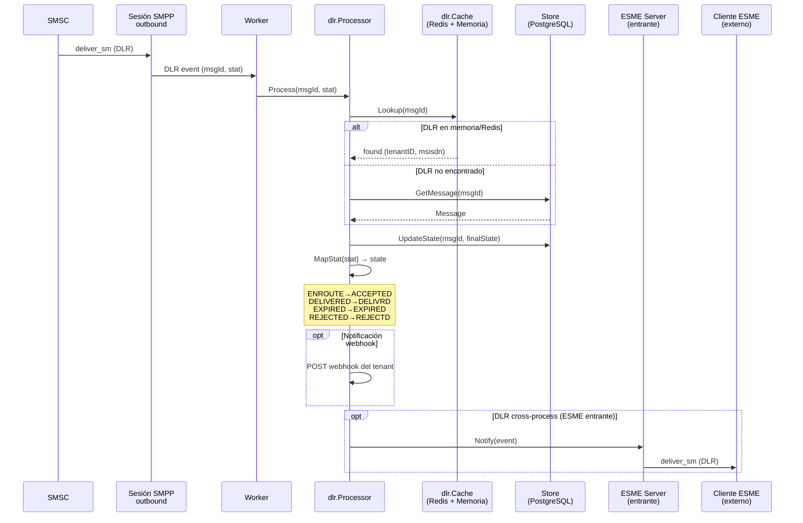

---

## 3. Reconciliación de DLR

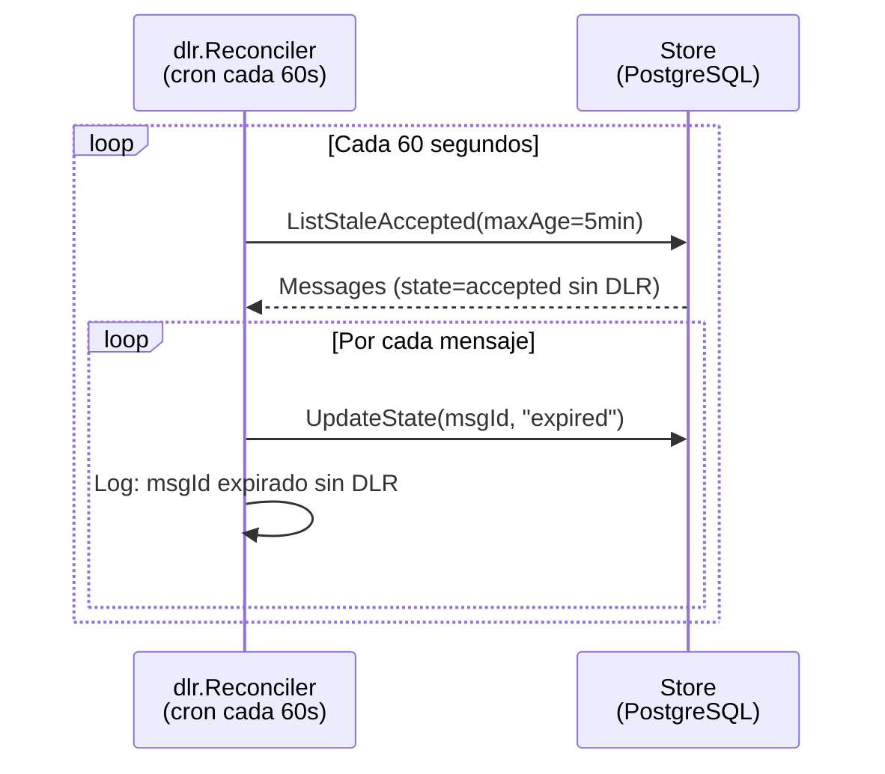

---

## 4. Conexión con Proveedor SMSC (conector outbound)

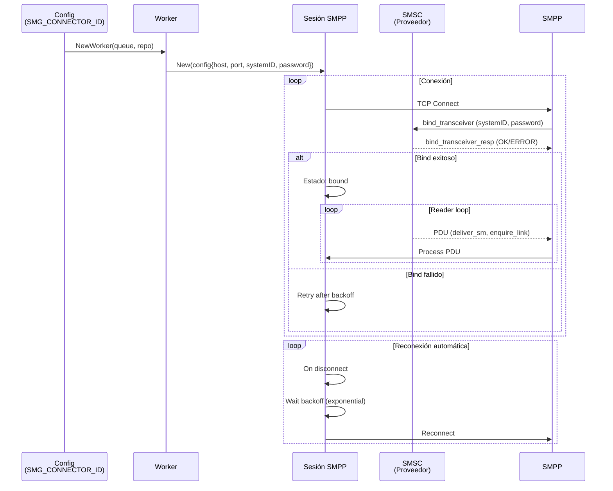

---

## 5. Conexión ESME Entrante (proveedor cliente se conecta a nosotros)

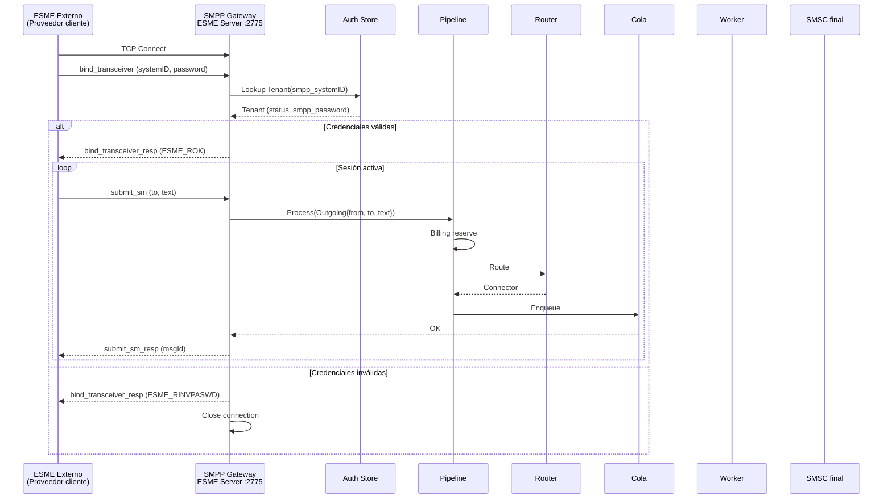

---

## 6. Routing con Grupos y Fallback

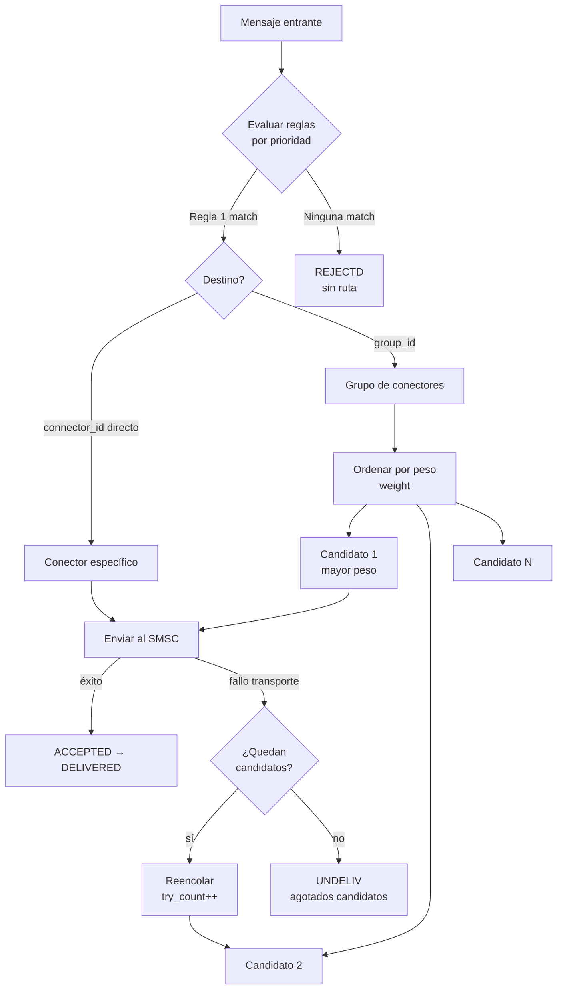

---

## 7. Billing — Flujo de Crédito

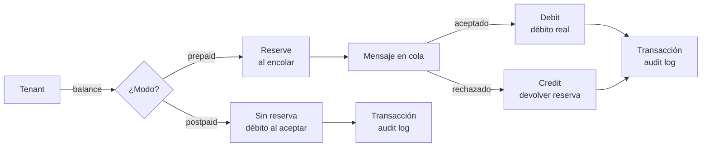

---

## 8. Flujo de un SMS end-to-end (resumen visual)

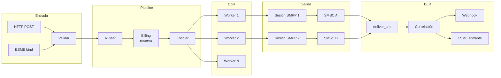

---

## 9. Estados del Mensaje (máquina de estados)

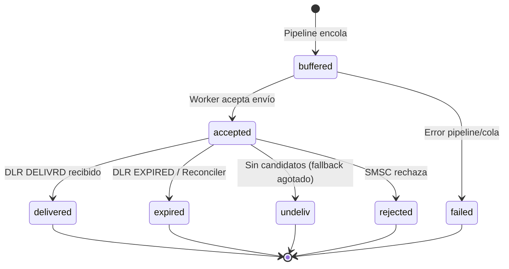

---

## 10. Arquitectura de componentes

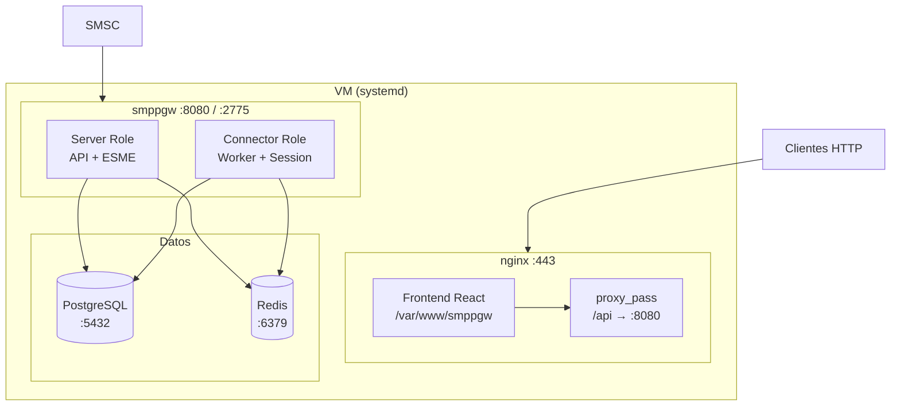

---

## 11. Deploy — Secuencia de instalación

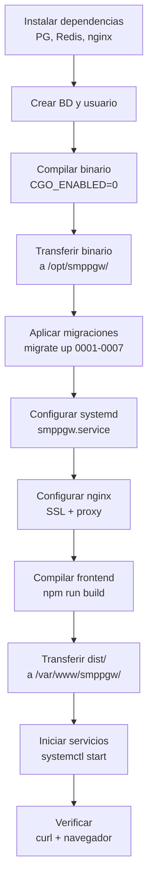
